# ✈️ AI 智能旅行规划师 (Smart Travel Agent)

基于 **FastAPI** + **LangGraph** 构建的高性能 AI 旅行规划系统。它不仅仅是一个简单的对话机器人，更是一个拥有自主思考、调研和规划能力的智能 Agent。


---

## ✨ 核心特性

- **🧠 深度思考 Agent**: 基于 LangGraph 的多节点工作流（调研 -> 骨架 -> 预算 -> 行程 -> 润色），模拟人类专家的规划逻辑。
- **⚡ 高性能并行架构**: 
  - **并行执行**: 使用 `asyncio.gather` 同时进行目的地调研和方案架构设计，响应速度提升 **30-40%**。
  - **Token 瘦身**: 中间思考步骤采用极简 JSON 输出，大幅降低首字延迟 (TTFT)。
- **🌊 实时流式响应**: 基于 SSE (Server-Sent Events) 实现打字机效果，让用户实时看到 AI 的思考和生成过程。
- **📊 真实数据可视化**: AI 自动从生成的文本中提取预算明细，动态渲染交互式饼图（非固定比例，而是基于 LLM 的真实估算）。
- **💾 智能历史管理**: 基于 SQLite + aiosqlite 的异步存储，自动保存规划记录，支持随时回溯。
  
- **🎨 Glassmorphism UI**: 现代化的玻璃拟态设计，提供丝滑的用户体验。

---

## 🛠️ 技术栈

- **Backend**: Python 3.12+, FastAPI, Uvicorn
- **AI Core**: LangGraph, LangChain, OpenAI (支持兼容 OpenAI 协议的模型，如 Gemini/DeepSeek)
- **Database**: SQLite (Async/aiosqlite)
- **Frontend**: Vanilla JS, CSS3 (Glassmorphism), EventSource API
- **Manager**: uv (超快速的 Python 包管理器)

---

## 🚀 快速开始

### 1. 环境准备

确保已安装 [uv](https://github.com/astral-sh/uv) (推荐) 或 Python 3.12+。

### 2. 安装依赖

```bash
# 如果使用 uv (推荐)
uv sync

# 或者使用 pip
pip install -r requirements.txt
```

*(本项目使用 `pyproject.toml` 管理依赖，推荐使用 uv)*

### 3. 配置环境变量

复制 `.env` 文件并填入你的 API Key：

```ini
# .env
OPENAI_API_KEY=sk-xxxxxx
OPENAI_API_BASE=https://api.example.com/v1
OPENAI_MODEL=gemini-1.5-pro-latest
```

### 4. 启动服务

```bash
# 启动开发服务器 (自动重载)
uv run uvicorn main:app --reload --port 8080
```

访问浏览器：[http://127.0.0.1:8080](http://127.0.0.1:8080)

---

## 📂 项目结构
```
.
├── main.py              # FastAPI 应用入口 (Refactored)
├── travel_agent.py      # LangGraph Agent 核心逻辑
├── schemas.py           # Pydantic 数据模型 (New)
├── prompts.py           # Prompt 模板库 (New)
├── database.py          # 异步数据库操作
├── apiset.py            # LLM API 配置
├── static/              # 前端静态资源
└── pyproject.toml       # 项目依赖配置
```

## 🧠 Agent 工作流架构

```mermaid
graph TD
    %% 定义样式
    classDef start fill:#f9f,stroke:#333,stroke-width:2px;
    classDef process fill:#e1f5fe,stroke:#01579b,stroke-width:1px;
    classDef parallel fill:#fff9c4,stroke:#fbc02d,stroke-width:1px,stroke-dasharray: 5 5;
    classDef decision fill:#f0f4c3,stroke:#827717,stroke-width:1px;
    classDef endNode fill:#c8e6c9,stroke:#2e7d32,stroke-width:2px;

    Start((用户输入)) --> ParallelInput{开始并行}
    
    subgraph ParallelProcessing [并行处理层]
        direction LR
        Research[🔍 实时调研节点<br/>DuckDuckGo Search] 
        Skeleton[📋 方案骨架节点<br/>预算分配/主题]
    end

    ParallelInput --> Research
    ParallelInput --> Skeleton
    
    Research --> Join[整合节点]
    Skeleton --> Join
    
    Join --> Writer[✍️ 详细规划生成]
    
    Writer --> BudgetAudit{💰 预算审核}
    BudgetAudit -- "不合规" --> Revise[🔄 调整方案]
    Revise --> BudgetAudit
    
    BudgetAudit -- "通过" --> QualityAudit{✨ 内容润色}
    
    QualityAudit --> SSE[🌊 SSE 流式输出]
    SSE --> EndNode((交付行程))

    %% 应用样式
    class Start start;
    class EndNode endNode;
    class Research,Skeleton parallel;
    class Writer,Revise,Join process;
    class BudgetAudit,QualityAudit decision;
```


<details>
<summary>点击查看 Mermaid 源代码</summary>


</details>

---

## 🧠 Agent 工作流详解

本项目的 Agent 并非简单的 Prompt 拼接，而是基于有向无环图 (DAG) 的状态机：

1.  **用户输入**: 接收出发地、目的地、预算、时间。
2.  **并行处理 (Parallel Node)**:
    *   `Research Node`: 实时联网检索最新的交通、景点、美食数据。
    *   `Skeleton Node`: 同步构建初步预算分配和每日主题。
3.  **详细规划 (Writer Node)**: 整合上述数据，生成详尽的每日行程。
4.  **循环校验 (Self-Correction)**: 
    *   `Budget Audit`: 检查总花费是否超标，不合格则打回重写。
    *   `Quality Audit`: 审核文案吸引力与实用性。
5.  **流式输出 (SSE)**: 最终方案通过 Server-Sent Events 实现毫秒级响应预览。

---


---

## 📈 性能优化记录

| 优化阶段 | 措施 | 效果 |
| :--- | :--- | :--- |
| **Phase 1** | 基础 LCEL 链 | 功能跑通，但串行执行慢 |
| **Phase 2** | `asyncio.gather` 并行化 | 调研与规划并行，**耗时减少 30%** |
| **Phase 3** | Prompt Token 瘦身 | 中间步骤改 JSON 输出，**首字延迟降低 60%** |

---

## 📝 License

MIT
